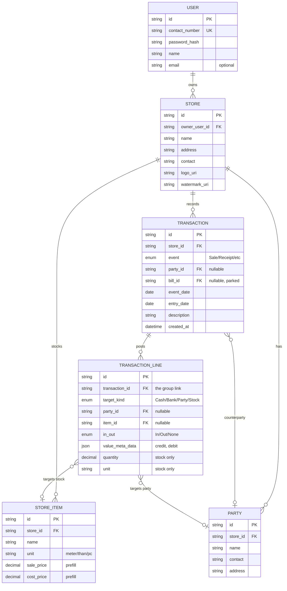

```mermaid
erDiagram
  USER ||--o{ STORE : owns
  STORE ||--o{ STORE_ITEM : stocks
  STORE ||--o{ PARTY : has
  STORE ||--o{ TRANSACTION : records
  TRANSACTION ||--o{ TRANSACTION_LINE : posts
  TRANSACTION }o--o| PARTY : counterparty
  TRANSACTION_LINE }o--o| PARTY : "targets party"
  TRANSACTION_LINE }o--o| STORE_ITEM : "targets stock"

  USER {
    string id PK
    string contact_number UK
    string password_hash
    string name
    string email "optional"
  }
  STORE {
    string id PK
    string owner_user_id FK
    string name
    string address
    string contact
    string logo_uri
    string watermark_uri
  }
  STORE_ITEM {
    string id PK
    string store_id FK
    string name
    string unit "meter/than/pc"
    decimal sale_price "prefill"
    decimal cost_price "prefill"
  }
  PARTY {
    string id PK
    string store_id FK
    string name
    string contact
    string address
  }
  TRANSACTION {
    string id PK
    string store_id FK
    enum event "Sale/Receipt/etc"
    string party_id FK "nullable"
    string bill_id FK "nullable, parked"
    date event_date
    date entry_date
    string description
    datetime created_at
  }
  TRANSACTION_LINE {
    string id PK
    string transaction_id FK "the group link"
    enum target_kind "Cash/Bank/Party/Stock"
    string party_id FK "nullable"
    string item_id FK "nullable"
    enum in_out "In/Out/None"
    json value_meta_data "credit, debit"
    decimal quantity "stock only"
    string unit "stock only"
  }
```