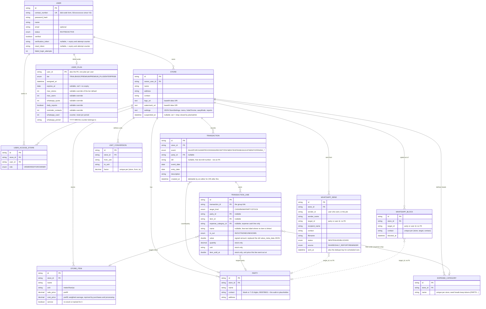

# Schema

Mirrors the JPA entities in `src/backend/.../entity` and the Flyway migrations in
`src/backend/src/main/resources/migrations` (baseline V1, current head V11).

`whatsapp_sends.target_id` and `whatsapp_blocks.target_id` hold a party id *or* a user id
depending on who was messaged, so they carry no FK — the dashed relations below say what
they point at in practice.

## Notes

- **`stores.settings` is a JSON blob, deliberately.** The backend validates its size and its
  `reports` half (`ReportSettings`, read by `ReportScheduler`) and treats the rest as opaque —
  menu keys belong to the client. See `StoreSettings` for why.
- **`user_plans` overrides are nullable on purpose.** Null means "use the tier's default"
  (`PlanTier`); a value is an admin-granted exception for that account.
- **No table for the scheduled reports.** `whatsapp_sends` is both the audit trail and the
  dedupe key — a run that already logged a send for that store/source/date does not repeat.
